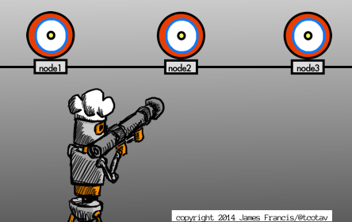

## The Official Unofficial Getting Started with ChefDK Guide

*There is no scene imaginable that cannot be further enhanced by adding giant robots - Aristotle*

### Overview

We're going to build a cookbook to support installing tomcat and a (canned) java war file on to an ubuntu host.  In doing this, we'll walk through the tools included in `chefdk` to help manage cookbooks and manage testing.

You'll need to:

- [get Chef DK](http://www.getchef.com/downloads/chef-dk/)
- [get Vagrant](http://vagrantup.com)

### Get your project started using new `chef` command

We're going to first generate a new cookbook.

    $ chef generate cookbook chefdk_getting_started

Take a peek at what you've done.  We've got a skeleton of a cookbook.

    $ ls chefdk_getting_started
    Berksfile	README.md	metadata.rb
    chefignore	recipes

### Get going with git immediately.

Let's get our git going immediately.  Commit often (but you knew that).

I'm a fan of git flow -- [Git Flow](https://github.com/nvie/gitflow) -- as a base workflow and branching model for my git projects.  It may be a bit much for a documentation/sample project, but that's how I roll.

Change to your newly created `chefdk_getting_started` directory and then:

    $ git flow init

(I use the defaults for git flow.  Spam the return key.)

Right after init, it drops me into the develop branch.

    $ git branch
    * develop
    master

(If you're using vanilla git, then just:  `$ git init` )

Then do the initial commit:

    $ git add -A
    $ git commit -m "initial commit"

Git sanity check:

    $ git status
    # On branch develop
    nothing to commit, working directory clean

And we're golden.  Next: test kitchen

  

### setting up test kitchen

With ChefDK installed, you've got test-kitchen all ready installed.  We're going to use it to write some tests for the cookbook that we're going to write in the latter steps so first things first.

Test drive the kitchen command:

    $ kitchen

The [docs on test-kitchen](http://www.kitchen.ci) are awesome by the way.  I'd recommend taking a run through their entire tutorial.

### kitchen.yml -- configuring test kitchen

The new `chef` tool already set us up to run kitchen.  In your basedir, you'll find the kitchen config file `.kitchen.yml`

`.kitchen.yml`

    ---
    driver:
      name: vagrant

    provisioner:
      name: chef_solo

    platforms:
      - name: ubuntu-12.04
      - name: centos-6.4

    suites:
      - name: default
        run_list:
          - recipe[bar::default]
        attributes:

By default, the `chef` app set you up to use [Vagrant](http://vagrantup.com) with the default of [Virtualbox](http://virtualbox.org) as your VM environment and including two vms: one centos and one ubuntu.

We can confirm those by running the command as follows:

    $ kitchen list
    Instance             Driver   Provisioner  Last Action
    default-ubuntu-1204  Vagrant  ChefSolo     <Not Created>
    default-centos-64    Vagrant  ChefSolo     <Not Created>

For general cookbook development, you'd want to hit up both the RH family and debian, but for now, we'll just use ubuntu.  Remove the line for centos

      - name: centos-6.4

and list again:

    $ kitchen list
    Instance             Driver   Provisioner  Last Action
    default-ubuntu-1204  Vagrant  ChefSolo     <Not Created>

Leaving just one vagrant box to install.

We have one more change to make to the `.kitchen.yml` file -- changing the run_list that we want applied to our soon-to-be-created-and-launched node.

Change this:

    run_list:
      - recipe[bar::default]

To this:

    run_list:
      - recipe[chefdk_getting_started]

Do a quick check-in of the change into git.

    $ git add .kitchen.yml
    $ git commit -m "updated kitchen yml -- 1 platform"

and then let's give it a shot:

    $ kitchen create all
    -----> Starting Kitchen (v1.2.1)
    -----> Creating <default-ubuntu-1204>...

And off it'll go.  I already have the vagrantbox for `ubuntu-1204` sitting around so that'll cut the run time of the command.  What is going on here is that kitchen is kicking off a `vagrant up` for the `ubuntu-1204` host image.  If you don't have it on your host, it will go out and retrieve it from the magical glorious intarwubz.  This might take a while.  Then it will bring up the host in normal vm fashion.

We can confirm our work with the following command:

    $ kitchen list
    Instance             Driver   Provisioner  Last Action
    default-ubuntu-1204  Vagrant  ChefSolo     Created

Note that the `Last Action` column changed from `<Not Created>` to `Created`.

Okay...  so now what?

### Kitchen converge

    $ kitchen converge

First you'll see it head out and grab the chef installer and install it on our ubuntu-1204 node.  I had an error (documented changing the cookbook name in `.kitchen.yml` without ACTUALLY changing the file...

If you run into any errors or problems, I'd recommend a good solid 10 minutes of hysterical sobbing followed by reading the error message and logs.

Invariably the chef client will run.  We don't have it doing anything yet so it is a bit anticlimactic.  We did change the state of the node to `Converged` though... so we got that going for us (which is nice).

    $ kitchen list
    Instance             Driver   Provisioner  Last Action
    default-ubuntu-1204  Vagrant  ChefSolo     Converged

### Do Something!

Hopefully you didn't start reading this late at night as you'll never be able to sleep with all this excitement.  Now we're going to do a bit of pure chef stuff.  The app we're writing is to set up a tomcat instance and drop a (canned) war into it along with a few other files.

What do we need to do that?  First, lets add a few public cookbooks: `tomcat`, `java`

Normally we'd start dicking around with a Gemfile to get `Berkshelf` installed to magically manage our cookbook dependencies, but `Berkshelf` is another component native to `chefdk` so yay team.

Further, if you look inside the cookbook directory (where we'll be doing
all of our custom cookbook work), you'll find the
`chefdk_getting_started` cookbook stubbed out for us by `chefdk`.

Inside that cookbook directory, you'll see

    $ ls
    Berksfile	chefignore	metadata.rb	recipes

We're not going to do anything with Berksfile.  It looks like this stubbed out:

`Berksfile`

    source "https://api.berkshelf.com"

    metadata

We use Berkshelf to help us manage cookbook dependencies.  Like we need tomcat for our cookbook.  Tomcat needs java.  This file though tells Berkshelf to defer to the `metadata.rb` file for its requirements.  We'll look at that file now.

`metadata.rb`

    name             'chefdk_getting_started'
    maintainer       ''
    maintainer_email ''
    license          ''
    description      'Installs/Configures '
    long_description 'Installs/Configures '
    version          '0.1.0'

Well, a whole lot of nothing going on there.  Not even my name, email address, or licensing...  Anyway, functionally we don't need that.  What we NEED to do is tell Berkshelf what cookbooks we're going to need for our custom recipe.

At the bottom, we add the line:

    depends "tomcat"

Oooookay, let's have a go with that.  We're going to run Berkshelf and tell it to go and get all of the dependencies for the tomcat cookbook.

    $ berks install
    Resolving cookbook dependencies...
    Fetching 'chefdk_getting_started' from source at .
    Fetching cookbook index from https://api.berkshelf.com...
    Using java (1.22.0)
    Using chefdk_getting_started (0.1.0) from source at .
    Using openssl (1.1.0)
    Using tomcat (0.15.12)

Time for happy dance.  It worked.  Commit metadata.rb changes into git.

What happened?  Well, using the Power of Berkshelf (tm) we imported cookbooks and dependencies by just including the name of the desired cookbook in the metadata.rb and then invoking the `berks` command to install them.  If you want to go and confirm that these new cookbooks are around, you can do a

    $ ls ~/.berkshelf/cookbooks
    java-1.22.0
    openssl-1.1.0
    tomcat-0.15.12

For the full description and docs on berkshelf, please go [to the website](http://www.berkshelf.com).

We've got our supporting cookbooks.  Now let's take a little step to using them.

### First Cookbook Recipe

  

If we run our kitchen job again, it will run the chef client on our
virtual node.  It will use the runlist we specified in the
`.kitchen.yml` but it still won't do anything.  Why's that?  Because we
haven't done anything with the default recipe in chefdk_getting_started.  Let's crack that file at:

`cookbooks/chefdk_getting_started/recipes/default.rb`

The file currently only has comments (the hash (#) denotes a comment line in these files).  So at the end of the file add this line:

    include_recipe 'tomcat'

Close and write the file.

Do a quick check-in to git (because that's how we all roll and we're on the dev branch after all...)

### Run Kitchen after some changes -- different node convergeance.

Now we're going to see if what we put into place will work -- we'll use the converge command to once again spin up the chef run on the node.  This time though, we gave the recipe something to do.  Several somethings in fact as you'll see from the output of the following command:

    $ kitchen converge

Well I'm not going to lie -- that command just exploded all over my console.  TO THE WET WIPES!

(Some time later...)

It didn't particularly like installing openjdk-6.  Maybe it was some transient failure?  Ideally, I'd be using jdk 7 anyway.

Wow -- this is a lot of stuff to install.

       0 upgraded, 88 newly installed, 0 to remove and 5 not upgraded.
       Need to get 66.4 MB of archives.

Failed on retrieving something from the repo, fwiw.  Not my problem and yet -- totally my problem.  Let's try to force jdk 7.  How do we do something like that?  A good place to look is the README.md of the cookbook we're fiddling with.  In this case, java.

### OMFG things went AWRY

So we need to try to install a different version of java.  We probably should've done this at the start, but we were lazy.  So, first we go to the chef cookbook community site and look up java.

Community Cookbook site link to [Java Cookbook](http://community.opscode.com/cookbooks/java).  This is scenic and all that.  Some pictures of funny looking people over in the right hand column of the page.  Get past that.  We want to look at [this cookbook on github](http://community.opscode.com/cookbooks/java).

(this is a hoot, isn't it?)

On the [java cookbook github page](http://community.opscode.com/cookbooks/java), scroll down to the README.md.  There we find the usage that we're looking for to grab openjdk version 7.  There's all kinds of stuff there that we could configure, but all we really want is `openjdk` version `7`.

in the `Attributes` section, we find attributes that match what we want.  They are:

    node['java']['install_flavor'] = 'openjdk'    # this is the default, but humor me.  let's be EXPLICIT!
    node['java']['jdk_version'] = '7'

Ok, great.  We've got those, but where do they go in our recipe?  We need to put them into the file that doesn't exist -- `attributes/default.rb`

So we create that directory path and then that file in the root of the
chefdk_getting_started cookbook directory and put those two lines into it.

`mkdir attributes`

`vim attributes/default.rb` # or whatever text editor you use .  paste in the above text though.

Check any outstanding changes into git.

ok, let's try that again with the convert

    $ kitchen converge

Failed again.  Same crap.  What in theeeeee WORLD is going on????  (This might not happen to you.  Bastards...).  Ok, here's what we'll do, we'll update all of the apt packages.  Maybe we're all just out of date.  So let's get our ancient ubuntu version updated a bit using apt and then we'll come back to this.

### But first, a word about attributes.

Attributes allow you to pass values or overrides into the cookbooks.  Attribute precedence is a bit of a complicated beast.  There are **7,421 different levels of precedence**.  There used to be **7,422** but one didn't make sense so they removed it.[<a href="#link-1">1</a>]  Anyway, you set the level and then put in the key as you would in dealing with a ruby Hash.

    <level>[<key>] = <value>

I use `default` which is the... default.  If we wanted to be sure to force that puppy in there, we might use `normal` or `override`.  You can learn more about [attribute precedence here](http://docs.opscode.com/essentials_cookbook_attribute_files.html#attribute-precedence).  Writing cookbooks, you'll want to pull variables out of the actual recipes (i.e. don't hardcode stuff) and put them here.  There are more advanced ways of handling things like that.  I'm sure we'll stumble upon them later.  Now on to getting apt working.

### Dusty Repos are bad -- back to our apt problem

Okay, everyone remembers how we add external cookbooks to our repo, right?  Yes, that's right -- `metadata.rb`

We edit metadata.rb adding the following line:

    depends "apt"

Berkshelf is made aware of it because of the relationship we set up between it and the metadata.rb file.  We run

    $ berks update
    Resolving cookbook dependencies...
    Fetching 'chefdk_getting_started' from source at .
    Fetching cookbook index from https://api.berkshelf.com...
    Using apt (2.3.10)
    Using chefdk_getting_started (0.1.0) from source at .
    Using tomcat (0.15.12)
    Using openssl (1.1.0)
    Using java (1.22.0)

There's apt.  But that just grabs the cookbook.  We want our recipe to use it.  So we add a line just like the tomcat line, **BUT** we need it to update the local packages **BEFORE** it does the java install else... same failure.  (Minor data point - if we did it in the reverse order, it would fail this time and would probably work next time as it would again try to get the node in the appropriate state AND it would have refreshed the apt packages).  Still, let's do it right (ish) this time.

First we edit

`recipes/default.rb`

so that it looks like this

    include_recipe 'apt'    # <---- we added this
    include_recipe 'tomcat'

and then let's give it a go!

    $ kitchen converge

And what to my wondering eyes did appear?  Well, not a lot of red error messages -- that's for sure.  It worked.  **Virtual High Five**

Man, that was such a rabbit hole dive I need to take a moment to figure out what in the world was going on before it.

(time passes)

  

### And now ACTUAL TESTING will occur

For that headline to be true though -- we'll have to write some tests.  There are different kinds of tests and test-kitchen supports a variety.  First we're going to put some stuff into what is arguably the EASIEST test-kitchen supported test type: bats.  [Bats](https://github.com/sstephenson/bats) stands for "bash automated testing system".  There are lots of examples there at the link.  To support this, we'll first make a test directory to use:

    mkdir -p test/integration/default/bats

and then create a file, `tomcat.rb`, inside of that directory.

`tomcat.rb`

    #!/usr/bin/env bats

    @test "java is found in PATH" {
      run which java
      [ "$status" -eq 0 ]
    }

    @test "tomcat process is visible " {
      result=$(ps aux | grep java | grep tomcat|wc -l)
      [ "$result" -eq 1 ]
    }

Okay, let's give that a test run.

    $ kitchen verify
    -----> Starting Kitchen (v1.2.1)
    -----> Verifying <default-ubuntu-1204>...
           Removing /tmp/busser/suites/bats
    Uploading /tmp/busser/suites/bats/tomcat.bats (mode=0644)
    -----> Running bats test suite
     ✓ java is found in PATH
     ✓ tomcat process is visible

    2 tests, 0 failures
           Finished verifying <default-ubuntu-1204> (0m0.95s).
    -----> Kitchen is finished. (0m1.89s)

Quick point there -- `kitchen verify` is what we do to verify that our test is working as we expect.  Invoking `kitchen test` would do a full test -- from spinning up a new vm, chef install, node converge, then test.  We'll do that later.  Probably.

Okay, so we got `bats` working and doing some tests.  Let's check it into `git` and then move on to adding more features to our cookbook.

### War -- huh!  Good God Y'All

Now we're going to push our war file up to the vm and into the webapps directory of the tomcat install.

The source that can be used to generate the war file is available in the [punter github repo](https://github.com/tcotav/punter).

We need to get the file, `punter.war` into our cookbook directory into the files directory of the cookbook.  First, let's make a spot to place the file.  In the cookbook base directory, do the following:

    mkdir -p files/default

and then place the punter.war into that directory.  We can either compile your own version of it or pull the one that was (hackishly wedged) [placed into git](https://github.com/tcotav/punter/blob/master/punter.war?raw=true).  So when we're done, the full path to the war in our cookbook is: `files/default/punter.war`

That's it for placing the file.  Now we need to modify our recipe to do something with it.  Time for some [cookbook_file](http://docs.opscode.com/resource_cookbook_file.html).

Open the file `recipes/default.rb` and modify it so that it looks like the following:

    #
    # Cookbook Name:: chefdk_getting_started 
    # Recipe:: default
    #
    # Copyright (C) 2014
    #
    #
    #

    include_recipe 'apt'
    include_recipe 'tomcat'

    cookbook_file "/var/lib/tomcat6/webapps/punter.war" do
      source "punter.war"
      mode 00744
      owner 'root'
      group 'root'
    end

All we're doing with this resource call is stating that we want the local `file/default/punter.war` source to be placed on the remote file system as `/var/lib/tomcat6/webapps/punter.war`

We can check if anything explodes by running:

    $ kitchen converge

and then manually log into the host via

    $ kitchen login

and confirm two things:

  1. that the file, `punter.war` is sitting in /var/lib/tomcat6/webapps
  2. and that next to it is the unrolled war directory named `punter`

Check it all into git and then we'll turn those two tests into coded reproducable callable tests.  How sexy is that?

Note,  I was going to switch over to `chefspec` here, but its not yet supported as of today.  Or at least properly supported.  So we'll revise this to use chefspec at some future date.

For now, we'll continue writing our code in bats.  We've already defined our tests above -- now we just need to translate them into code.

    @test "war is placed in proper location " {
      run [ -f /var/lib/tomcat6/webapps/punter.war ]
      [ "$status" -eq 0 ]
    }

    @test "war is unrolled" {
      run [ -d /var/lib/tomcat6/webapps/punter ]
      [ "$status" -eq 0 ]
    }

Append these two lines to your `test/integration/default/bats/tomcat.bats` file.  Basically we make use of bash's built in [file test operators](http://www.tldp.org/LDP/abs/html/fto.html) to confirm the war is in place AND that it had been properly unrolled.

We run the test using the kitchen command:

    $ kitchen verify
    -----> Starting Kitchen (v1.2.1)
    -----> Verifying <default-ubuntu-1304>...
           Removing /tmp/busser/suites/bats
    Uploading /tmp/busser/suites/bats/tomcat.bats (mode=0644)
    -----> Running bats test suite
     ✓ java is found in PATH
     ✓ tomcat process is visible
     ✓ war is placed in proper location
     ✓ war is unrolled

    4 tests, 0 failures
           Finished verifying <default-ubuntu-1304> (0m1.00s).
    -----> Kitchen is finished. (0m1.96s)

Another successful test run.  Check everything into git.  Go get a beers.

### Chefspec

    mkdir -p test/integration/default/chefspec

TBD -- this should magically work.  It does not.  So we delay for now.  I'm going to step away from the keyboard for a moment and weep.

[Here's why it's not working at the moment.  Soon(tm)](https://github.com/opscode/chef-dk/issues/18)

(time passes)

  

### Adding Serverspec

Now we're going to jury rig `serverspec` into our example and duplicate the `bats` testing that we did above.  Serverspec is another test platform that tests your actual servers via ssh.

But wait, why would we write the same tests AGAIN?  What sort of testing is done by chefspec/bats and what is done by serverspec.  Well it is good that you asked that, Timmy.  Take a seat and let's fire up the magic whiteboard.  The heart of it is that we can run serverspec against any hosts.  So we're essentially writing tests that can be applied to deployments in QA, Dev, Stage, Production, and any other exotic sci-fi themed environment name you've got at your company.  It is portable.  If you can see it and ssh to it, you can run serverspec against it.

That's all well and good, but for now, we just want test kitchen to spin up something and run serverspec tests against it.  We'll come back to testing against additional nodes.

First, we want to make sure our environment is ready to go.  We assume that you've got ruby and bundler all ready to go.

If you've got `bundler`, then simply

`bundle`

If you do NOT have `bundler`, then manually install

`gem install serverspec`

That's it for the grander setup.

First lets tell kitchen what we're doing.  We edit the `.kitchen.yml` file so that it looks like this:

    ---
    driver:
      name: vagrant

    provisioner:
      name: chef_solo

    platforms:
      - name: ubuntu-13.04

    suites:
      - name: default
        run_list:
          - recipe[chefdk_getting_started::default]
        attributes:
      - name: server
        run_list:
          - recipe[chefdk_getting_started::default]
        attributes:

We added the `server` suite.  We'll make use of that shortly.

### Initializing serverspec

The [website for test kitchen](http://kitchen.ci/docs/getting-started/writing-server-test) has awesome docs.  You should read them.  Lets make our serverspec directory.

    mkdir -p test/integration/default/serverspec

Now create our test file in that directory.  It must be an .rb file, and it must match the pattern *_spec.rb.

`tomcat_spec.rb`

    require 'serverspec'

    include Serverspec::Helper::Exec
    include Serverspec::Helper::DetectOS

    describe package('openjdk-7-jdk') do
      it { should be_installed }
    end

    describe package('tomcat6') do
      it { should be_installed }
    end

    describe port(8080) do
      it { should be_listening }
    end

    describe file('/var/lib/tomcat6/webapps/punter.war') do
      it { should be_file }
    end

    describe file('/var/lib/tomcat6/webapps/punter') do
      it { should be_directory }
    end

How unexciting and unoriginal is that?  We just replicated the same tests we did in the `bats` test.  Sad clown.  Sad clown.  We'll talk about what to test and where later.  For now, let's just run with this.

So again, we run the same command to get this test going.  Note, since we moved this test into a separate suite, kitchen will build out a completely separate vm to work against.  I say this just so you're not surprised at how long this takes (just for the first go-around) and disk usage.

    $ kitchen verify

Fire that puppy off.  It will run both the default tests as well as the new server (serverspec based) tests.  Here's what a run of that should look like:

    $ kitchen verify
    -----> Starting Kitchen (v1.2.2.dev)
    -----> Verifying <default-ubuntu-1304>...
           Removing /tmp/busser/suites/chefspec
           Removing /tmp/busser/suites/bats
    Uploading /tmp/busser/suites/bats/tomcat.bats (mode=0644)
    Uploading /tmp/busser/suites/chefspec/tomcat_spec.rb (mode=0644)
    -----> Running bats test suite
     ✓ java is found in PATH
     ✓ tomcat process is visible
     ✓ war is placed in proper location
     ✓ war is unrolled

    4 tests, 0 failures
           Finished verifying <default-ubuntu-1304> (0m1.40s).
    -----> Verifying <server-ubuntu-1304>...
           Removing /tmp/busser/suites/serverspec
    Uploading /tmp/busser/suites/serverspec/localhost/tomcat_spec.rb (mode=0644)
    -----> Running serverspec test suite
    /opt/chef/embedded/bin/ruby -I/tmp/busser/suites/serverspec -S /opt/chef/embedded/bin/rspec /tmp/busser/suites/serverspec/localhost/tomcat_spec.rb --color --format documentation

    Package "openjdk-7-jdk"
      should be installed

    Package "tomcat6"
      should be installed

    Port "8080"
      should be listening

    File "/var/lib/tomcat6/webapps/punter.war"
      should be file

    File "/var/lib/tomcat6/webapps/punter"
      should be directory

    Finished in 0.08279 seconds
    5 examples, 0 failures
           Finished verifying <server-ubuntu-1304> (0m1.20s).
    -----> Kitchen is finished. (0m3.20s)

Test kitchen run of serverspec works great.  So what about kicking off this against some random set of nodes?  You'll need to sit down for this.  Its just that awesome.

### Serverspec, no test kitchen

I'm going to put words here.  Good words.  Clear words.  You learn much.  Yes.

### Footnotes:

[<a name="link-1">1</a>] - this is 100% fabricated.  See docs for real attribute hierarchy
